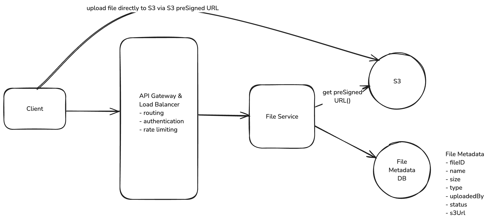

# Design Dropbox

## Functional Requirements

1. Users should be able to upload a file from any device
2. Users should be able to download a file from any device
3. Users can automatically sync files across devices

## Non Functional Requirements

1. Availability > Consistency
2. The system should support files as large as 50GB
3. The system should make upload, download, and sync times as fast as possible (low latency)

## Core Entities

1. File
2. File Metadata
3. User

## APIs

```
// Upload a file
POST /files
Request:
{
  File, 
  FileMetadata
}
```

```
// Download a file
GET /files/{fileId} -> File & FileMetadata
```

```
// Sync a file
GET /files/{fileId}/changes -> FileMetadata[]
```

## High Level Design

**Users should be able to upload a file from any device**

**1. Upload Metadata**

For the metadata, we can use a NoSQL database like DynamoDB. DynamoDB is a fully managed NoSQL database hosted by AWS.
Our metadata is loosely structured, with few relations and the main query pattern being to fetch files by user.

Our schema will be a simple document and can start with something like this:

```
  {
    "id": "123",
    "name": "file.txt",
    "size": 1000,
    "mimeType": "text/plain",
    "uploadedBy": "user1"
  }
```

**2. Upload File**

- Request a pre-signed URL from our backend (which itself gets the URL from the Blob Storage service like S3) and save
  the file metadata in our database with a status of "uploading."
- Use the presigned URL to upload the file to Blob Storage directly from the client. This is via a PUT request directly
  to the presigned URL where the file is the body of the request.
- Once the file is uploaded, the Blob Storage service will send a notification to our backend using S3 Notifications.
  Our backend will then update the file metadata in our database with a status of "uploaded".



**Users should be able to download a file from any device**

- Request a presigned download URL from our backend
- Use the presigned URL to download the file from the Blob Storage service directly to the client

**Users can automatically sync files across devices**

**Local -> Remote**

- Monitors the local Dropbox folder for changes using OS-specific file system events (like FileSystemWatcher on Windows
  or FSEvents on macOS)
- When it detects a change, it queues the modified file for upload locally
- It then uses our upload API to send the changes to the server along with updated metadata
- Conflicts are resolved using a "last write wins" strategy - meaning if two users edit the same file, the most recent
  edit will be the one that's saved

**Remote -> Local**

- Polling: The client periodically asks the server "has anything changed since my last sync?" The server would query the
  DB to see if any files that this user is watching has a updatedAt timestamp that is newer than the last time they
  synced.

## Deep Dive

**How can you support large files?**

User should have:

- Progress Indicator: Users should be able to see the progress of their upload so that they know it's working and how
  long it will take.
- Resumable Uploads: Users should be able to pause and resume uploads. If they lose their internet connection or close
  the browser, they should be able to pick up where they left off

Limitations of uploading a large file via single POST request:

- Timeouts: Web servers and clients typically have timeout settings to prevent indefinite waiting for a response. A
  single POST request for a 50GB file could easily exceed these timeouts.
- Browser and Server Limitation: Both browsers and web servers often impose limits on the size of a request payload.
- Network Interruptions: Large files are more susceptible to network interruptions. If a user is uploading a 50GB file
  and their internet connection drops, they will have to start the upload from scratch.
- User Experience: Users are effectively blind to the progress of their upload. They have no idea how long it will take
  or if it's even working.

**Chucking**:

- To address these limitations, we can use a technique called "chunking" to break the file into smaller pieces and
  upload them one at a time (or in parallel, depending on network bandwidth). Chunking needs to be done on the client so
  that the file can be broken into pieces before it is sent to the server (or S3 in our case).
- how will we handle resumable uploads? We need to keep track of which chunks have been uploaded and which haven't. We
  can do this by saving the state of the upload in the database, specifically in our FileMetadata table. Let's update
  the FileMetadata schema to include a chunks field.

```
{
  "id": "123",
  "name": "file.txt",
  "size": 1000,
  "mimeType": "text/plain",
  "uploadedBy": "user1",
  "status": "uploading",
  "chunks": [
    {
      "id": "chunk1",
      "status": "uploaded"
    },
    {
      "id": "chunk2",
      "status": "uploading"
    },
    {
      "id": "chunk3",
      "status": "not-uploaded"
    }
  ]
}
```

**How to uniquely identify a file / a chunk?**

- When you try to resume an upload, the very first question that should be asked is: (1) Have I tried to upload this
  file before? and (2) If yes, which chunks have I already uploaded? To answer the first question, we cannot naively
  rely on the file name.
- A fingerprint is a mathematical calculation that generates a unique hash value based on the content of the file. This
  hash value, often created using cryptographic hash functions like SHA-256, serves as a robust and unique identifier
  for the file regardless of its name or the source of the upload. By computing this fingerprint, we can efficiently
  determine whether the file, or any portion of it, has been uploaded before.

**Complete Upload Process**

- The client will chunk the file into 5-10Mb pieces and calculate a fingerprint for each chunk. It will also calculate a
  fingerprint for the entire file, this becomes the fileId.
- The client will send a GET request to fetch the FileMetadata for the file with the given fileId (fingerprint) in order
  to see if it already exists -- in which case, we can resume the upload.
- If the file does not exist, the client will POST a request to /files/presigned-url to get a presigned URL for the
  file. The backend will save the file metadata in the FileMetadata table with a status of "uploading" and the chunks
  array will be a list of the chunk fingerprints with a status of "not-uploaded".
- The client will then upload each chunk to S3 using the presigned URL. After each chunk is uploaded, S3 will send a
  message to our backend using S3 event notifications. Our backend will then update the chunks field in the FileMetadata
  table to mark the chunk as "uploaded".
- Once all chunks in our chunks array are marked as "uploaded", the backend will update the FileMetadata table to mark
  the file as "uploaded".

**How can we make uploads, downloads, and syncing as fast as possible?**

Compression

**How can you ensure file security?**

- Encryption in Transit: HTTPS
- Encryption at Rest: S3 server-side encryption