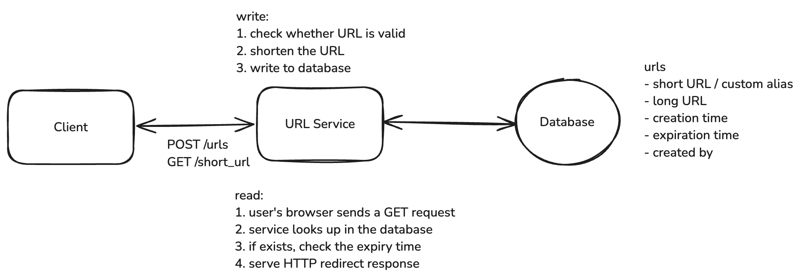

# Design URL Shortening Service

## Functional Requirements

1. Users should be able to submit a long URL and receive a shortened URL.

    - Optionally, users should be able to specify a custom alias for the shortened URL.
    - Optionally, users should be able to specify an expiration date for the shortened URL.

2. Users should be able to access the original URL using the shortened URL.

## Non Functional Requirements

1. Ensure uniqueness for the shortened URLs. (No two long URLs should map to the same short URL.)
2. Redirection should occur with minimal latency.
3. Availability > Consistency
4. Support 1B shortened URLs (in total) & 100M DAU

## Capacity Estimation

**Storage Estimation**:

Assume metadata entry for each URL is 500 bytes.

Short URL -> 8 bytes

Long URL -> 100 bytes

Created At -> 8 bytes

User ID -> 8 bytes

TTL -> 8 bytes

Total Storage = 500 bytes * 1B = 500 GB

**Traffic Estimation**:

Assume 100M DAU with 10 requests per user per day

Total Requests = 100M * 10 = 1B requests per day

Total Requests per second = 1B / 10^5 = 10k request / second

Assume 1% of requests are for shortening URLs

Total Shortening Requests = 10k * 0.01 = 100 requests / second

## Core Entities

1. User
2. Original URL
3. Shortened URL

## APIs

```
// Shorten a URL
POST /urls
{
  "long_url": "https://www.example.com/some/very/long/url",
  "custom_alias": "optional_custom_alias",
  "expiration_date": "optional_expiration_date"
}
->
{
  "short_url": "http://short.ly/abc123"
}
```

```
// Redirect to Original URL
GET /{short_code}
-> HTTP 302 Redirect to the original long URL
```

## High Level Design

**1. Users should be able to submit a long URL and receive a shortened URL**


**2. Users should be able to access the original URL using the shortened URL**



### HTTP Redirect Response

**301 (Permanent Redirect)**: This indicates that the resource has been permanently moved to the target URL. Browsers
typically cache this response, meaning subsequent requests for the same short URL might go directly to the long URL,
bypassing our server.

```
HTTP/1.1 301 Moved Permanently
Location: https://www.original-long-url.com
```

**302 (Temporary Redirect)**: This suggests that the resource is temporarily located at a different URL. Browsers do
not cache this response, ensuring that future requests for the short URL will always go through our server first.

```
HTTP/1.1 302 Found
Location: https://www.original-long-url.com
```

**For URL Shortener, 302 redirect is preferred**:

- It allows us to update or expire links as needed
- It allows us to track click statistics for each short URL

## Deep Dive

**1. How can we ensure short urls are unique?**

**i. Random Number Generation** (Collision)

```
input_url = "https://www.example.com/some/very/long/url"
random_number = Math.random()
short_code_encoded = base62_encode(random_number)
short_code = short_code_encoded[:8] # 8 characters
```

**ii. Hash the long URL** (Collision)

**iii. Unique counter with Base62 encoding**

- simply increment a counter for each new url
- encode it using base62 encoding to ensure it's a compacted representation
- we can use Redis INCR command
- Being single-threaded means Redis processes one command at a time, eliminating race conditions

**2. How can we ensure that redirects are fast?**

**i. Add an index**

- To avoid a full table scan, we can use a technique called indexing
- We should designate the short code as the primary key of our table. This automatically creates an index and ensures
  uniqueness.
- For databases that support it (like PostgreSQL), we can use hash indexing on the short code column. This provides O(1)
  average case lookup time, which is faster than B-tree for exact match queries

**ii. Implement an in-memory cache (redis)**

- When a redirect request comes in, the server first checks the cache. If the short code is found in the cache (a cache
  hit), the server retrieves the long URL from the cache, significantly reducing latency. If not found (a cache miss),
  the server queries the database, retrieves the long URL, and then stores it in the cache for future requests.

**iii. Use a CDN**

- The short URL domain is served through a CDN geographically distributed around the world. The CDN nodes cache the
  mappings of short codes to long URLs, allowing redirect requests to be handled close to the user's location

**3. How can we scale to support 1B shortened urls and 100M DAU?**

- Size of database (500 GB). We could always shard our data across multiple servers but a single Postgres instance, for
  example, should do for now.
- What if DB goes down? By using a database like Postgres that supports replication, we can create multiple identical
  copies of our database on different servers. If one server goes down, we can redirect to another.
- We can scale our Primary Server by separating the read and write operations. This introduces a microservice
  architecture where the Read Service handles redirects while the Write service handles the creation of new short urls.
  This separation allows us to scale each service independently based on their specific demands.
- Horizontally scaling our write service introduces a significant issue, we need a single source of truth for the
  counter. We could solve this by using a centralized Redis instance to store the counter. Now, when a user requests to
  shorten a url, the Write Service will get the next counter value from the Redis instance, compute the short code, and
  store the mapping in the database.
- Additional redis network request for each new write request? We could always use a technique called "counter batching"
  to reduce the number of network requests.

**Counter Batching**:

  * Each Write Service instance requests a batch of counter values from the Redis instance (e.g., 1000 values at a time).
  * The Redis instance atomically increments the counter by 1000 and returns the start of the batch.
  * The Write Service instance can then use these 1000 values locally without needing to contact Redis for each new URL.
  * When the batch is exhausted, the Write Service requests a new batch.

## Final Design


