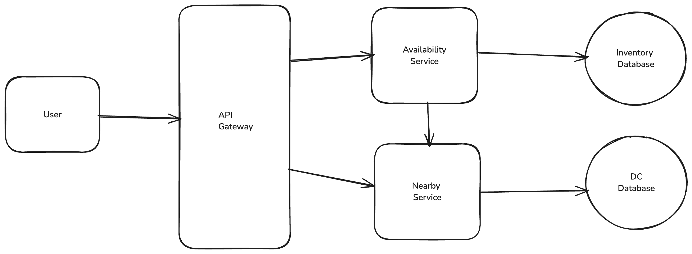
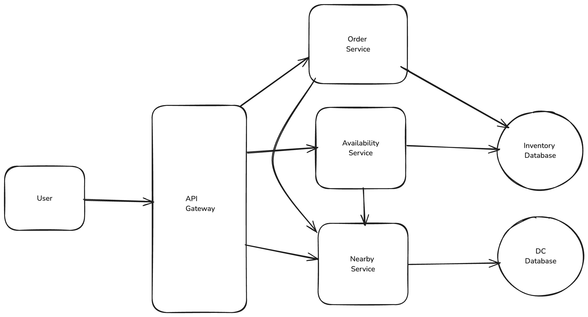

# Local Delivery Service

## Functional Requirements

1. Users should be able to query availability of item, deliverable in 1 hour, by location
2. Users should be able to order multiple items at the same time

## Non Functional Requirements

1. Availability requests should be fast (<200 ms) to support use cases like search
2. Ordering should be strongly consistent to avoid double booking
3. 10k DCs and 100k items per DC
4. 10m orders per day

## Core Entities

1. Item
2. Inventory
3. Distribution Center
4. Order (Collection of inventory items + shipping / billing info)

## APIs

```
GET /availability?lat={lat}&long={long}&keyword={}&page_size={}&page_num={} -> Item[]
```

```
POST /orders -> OrderId
{
  "items": Item[],
  "shippingInfo": ShippingInfo,
  "billingInfo": BillingInfo
}
```

## High Level Design

**Customers should be able to query availability of items**



- We make a request to the availability service with the user's location X and Y
- The availability service fires a request to the nearby service
- The nearby service returns us a list of DC that can deliver to our location
- The availability service query our database with those DC IDs
- We sum up the results and return them to our client

**Customers should be able to order items(no double booking)**

**Singular Postgres Transaction**

- The user makes a request to the Orders Service to place an order for items A, B, and C.
- The Orders Service makes creates a singular transaction which we submit to our Postgres leader. This transaction: a.
  Checks the inventory for items A, B, and C > 0. b. If any of the items are out of stock, the transaction fails. c. If
  all items are in stock, the transaction records the order and updates the status for inventory items A, B, and C to "
  ordered". d. A new row is created in the Orders table (and OrderItems table) recording the order for A, B, and C. e.
  The transaction is committed.
- If the transaction succeeds, we return the order to the user.



## Deep Dive

**Make availability lookups fast and scalable**

**Query Inventory through cache**

We can add a Redis instance to our setup. Our availability service can query the cache for a given set of inputs and, if
the cache hits, return that result. If the cache misses we'll do a lookup on the underlying database and then write the
results into the cache. Setting a low TTL (e.g. 1 minute) ensures that these results are fresh.

**Postgres read replicas & partitioning by region ID**